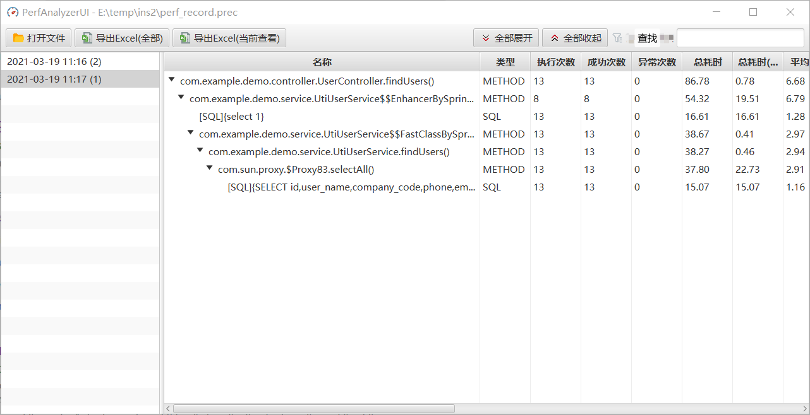

# perf-analyzer：javaagent式性能监控工具+分析UI

## 1. 工程介绍

Java工程进行性能调优的时候，最重要的是能有一种方法准确找到性能瓶颈点。

分析性能瓶颈一般也无非是埋点/输出日志/分析这三步，但传统开源方案（如perf4j）需要手工插入大量埋点代码，即使利用aop等方式也需要重新打包发布。而商业解决方案（比如DynaTrace或者XRebel等）需要购买以及部署整套系统，一般来说更适用于正规的生产环境监控。可有时我可能就是需要对某套开发中的程序在测试机器（甚至开发用的PC机）上进行一下压测来分析性能问题，要准备整套商用解决方案会比较困难。

这套工程与商用软件类似，使用javaagent来作为埋点方式。agent监控程序中各个要拦截的方法的性能参数，输出到本地文件中。之后用分析UI工具可以打开输出的文件来查看拦截到的性能分析结果。虽然功能很简单，但使用起来比手工改代码埋点应该要方便很多，对于需要排查一下特定功能的问题时应该也足够用了。

## 2. 使用说明

工程进行maven打包后会得到两个主要的jar包：

1. perf-analyzer-agent/target/perf-analyzer-agent.jar：这是一个javaagent jar包，用于对应用程序进行性能监控。
2. perf-analyzer-ui/target/perf-analyzer-ui.jar：分析UI的自启动jar包，用于查看监控工具输出的文件。

其中 perf-analyzer-agent.jar 需要以javaagent方式安装到现有应用程序或中间件上使用。应用程序或中间件使用的Java，最小支持到Java 6版本。

perf-analyzer-ui.jar 则是给开发人员本机使用的，目前支持Java 8和Java 11版本（9/10或者更新的版本目前没试过），注意不支持Java 6。

### 2.1 性能监控工具使用

首先将 perf-analyzer-agent.jar 包保存到一个本地目录下，目录名称中不要含中文或空格，避免报错。下面示例中假设这个目录是 D:\tools\

在 perf-analyzer-agent.jar 同一个目录下，新建一个 perf-analyzer-agent.yml 文件，内容示例如下：

```yaml
# 输出性能数据的文件，注意如果是相对路径，是相对于程序启动目录，而不是agent jar包的位置
outputFile: "./perf_record.prec"

# 拦截切面，可配置多个
aspects:
    # 包含的类名，可用*通配符，可多个分号隔开
    # 类名中的通配符：一个*匹配单层包名或类名，两个**通配符则包含子包。
    # 例：com.example.* 表示 com.example 单个包下的所有类
    # 例：com.example.** 表示 com.example 包以及所有子包下的所有类
  - includeClasses: "com.example.**"
    # 排除的类名，可用*通配，可多个分号隔开
    excludeClasses: "com.example.**po.*;com.example.**vo.*"
    # 包含的方法名，可用*通配，可多个分号隔开
    includeMethods: "*"
    # 排除的方法名，可用*通配，可多个分号隔开
    excludeMethods: "hashCode;equals"
```

需要进行性能监控拦截的类名/方法名请根据要监控系统的实际情况进行修改。注意aspects节点是一个yaml列表格式，如果单一个include/exclude满足不了具体要求可以配多个的。

之后修改应用程序的启动脚本，增加 `-javaagent:D:\tools\perf-analyzer-agent.jar`，根据程序种类或中间件的不同，修改方式可能也不一样。各种中间件怎么增加javaagent请在网上找下资料。这里举一个spring-boot工程自启动jar包的执行命令为例：

```sh
java -javaagent:D:\tools\perf-analyzer-agent.jar -jar spring-boot-demo-1.0.0.jar
```
之后启动程序，进行压测。正常情况下一分钟后就会生成outputFile配置项所指定的输出文件了。输出文件每分钟写入前一分钟的所有信息，运行期间也是可以复制出来进行查看的。

### 2.2 分析UI使用

获取到生成的输出文件（上面示例中的perf_record.prec）后，可以将其复制到本地机器上，然后用命令启动分析UI（注：堆内存参数请根据需要调整，要打开越大的文件需要内存越多）：

```sh
java -Xmx256m -jar perf-analyzer-ui.jar
```



**上方工具栏**

- **打开文件**: 点击这个按钮选择性能分析工具生成的.prec文件。
- **导出Excel(所选)**: 将左侧列表中选择的分钟导出为一个Excel文件。
- **导出Excel(全部)**: 将整个打开文件的内容导出为一个Excel文件，每分钟的信息为一个sheet。

**左侧选择列表**: 打开文件后，展示性能分析文件记录的各个分钟（分钟右边的括号里面数字是详细记录的根节点个数），点击选择一条后在右侧树形表格中展示详细信息。

**右侧树形表格**: 每一级的树形节点表示某个被拦截到的方法，“方法名”列为完整的“类名.方法名(参数类型)”。树形的层级关系表示方法的调用关系，父节点为调用方，子节点为被调用方法。右侧的列为方法执行各项统计数据，其中名称含“（除子节点）”的，表示去除了子节点执行耗时以外的耗时，即这个方法自身其他代码的耗时信息。

**导出的Excel**: 大致也保留了树形列表的样子，每分钟导出成一个sheet。


## 3. 程序说明

总体结构：

- *perf-analyzer-core*: 这个工程是另外两个工程依赖的公共部分，包含如性能监控对象模型和记录工具等。
- *perf-analyzer-agent*: 工程中包含了对应的配置文件解析程序，以及使用ByteBuddy库对类加载进行增强的功能，打包出来是一个javaagent jar包。
- *perf-analyzer-ui*: 工程中使用javafx做了一套ui，用于打开和展示记录下来的性能分析日志文件。

程序本身量不是很大，我也尽量加了注释，应该可以直接看明白意思。

其他说明点：

- perf-analyzer-core中目前记录下来的文件是用到了Java序列化，但为了实现每分钟追加写入（但又不希望长时间锁定文件），所以不是一个可以直接用*ObjectInputStream*来读的文件。具体文件格式见*perfanalyzer.core.io.PerfIOSupport*类。
- perf-analyzer-ui中使用了javafx（需要一个TreeTableView控件，Swing没有），试了一下JDK8编译打包运行都挺正常，但因为javafx从11版本开始从JDK里面独立出来作为开源库了，再加上Java9以后的模块化（而这个工程本身又要兼容到Java6，所以不能完全模块化），总体变得比较难搞。目前是借鉴了网上的说明，用另写一个main方法类的方式绕过JRE模块检查来打fatjar的方式，试了下应该Java8和Java11版本都能用了。具体见*perfanalyzer.ui.PerfAnalyzerUIMain*类上的注释说明。
